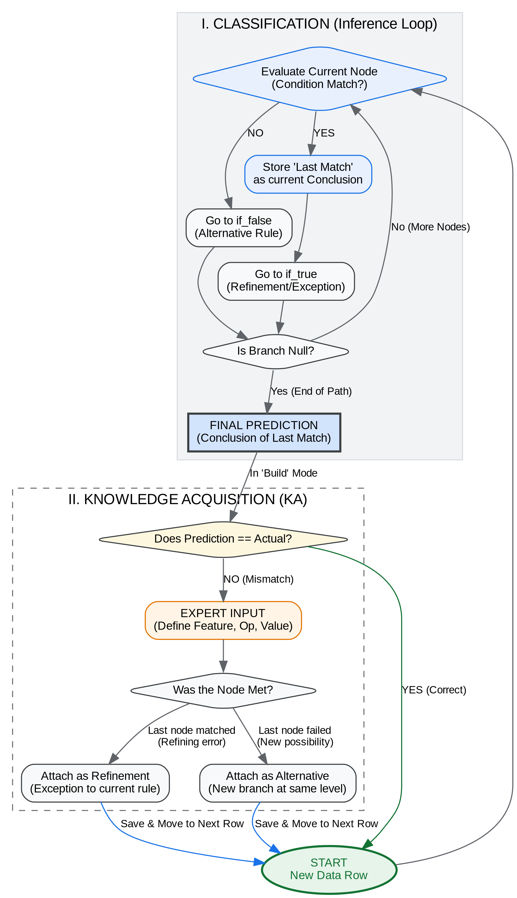
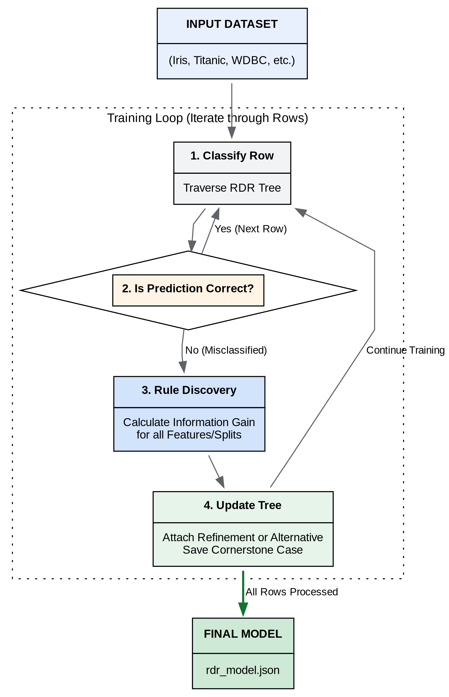

# SCRDR Tutorial

ဒီ SCRDR Tutorial က လက်ရှိ သင်ကြားနေတဲ့ AI Engineering Class (Fundamental) အတန်းက ကျောင်းသား/သူ တွေအတွက် ရည်ရွယ်ပြီး ပြင်ဆင်ထားခဲ့တဲ့ Tutorial ပါ။ Ripple-Down Rules က တကယ်အသုံးဝင်တဲ့ knowledge-acquisition နည်းလမ်းတစ်ခုဖြစ်ပြီး လက်တွေ့ တည်ဆောက်ထားတဲ့ system တွေကိုလည်း industry မှာအသုံးပြုနေတာ အများကြီးရှိတာမို့ AI engineering ကို စိတ်ဝင်စားတဲ့ သူတွေအတွက် ရည်ရွယ်ပြီး public ဖွင့်ပြီး ရှဲပေးထားလိုက်ပါတယ်။ တကယ်က Single Classification RDR, Multiple Classification RDR နဲ့ General RDR ဆိုပြီး သုံးမျိုး ရှိပေမဲ့ Industry မှာ အသုံးများတဲ့ ကိုယ်တိုင်လည်း အများကြီး သုံးခဲ့တဲ့ Single Class Ripple-Down Rules (SCRDR) ကိုပဲ ဒီ Tutorial မှာ သင်ကြားပေးသွားပါမယ်။  

အခုမှ စလေ့လာတဲ့ ကျောင်းသားတွေအနေနဲ့က အောက်ပါအစီအစဉ်အတိုင်း လေ့လာသွားရင် အဆင်ပြေမယ်လို့ ယူဆပါတယ်။  

1. *Ripple-Down Rules, An Alternative to Machine Learning* by Paul Compton \& Byeong Ho Kang စာအုပ်ကို ရှာဖွေဖတ်ပါ။ အဲဒီစာအုပ်ကို အကျဉ်းချုပ်ရှင်းထားတဲ့ presentation slide: RDR-Intro ([https://github.com/ye-kyaw-thu/SCRDR_tutorial/blob/main/slide/RDR_Intro.pdf](https://github.com/ye-kyaw-thu/SCRDR_tutorial/blob/main/slide/RDR_Intro.pdf)) ကိုလည်း တင်ပေးထားပါတယ်။
2. Interactive-RDR-Learning.ipynb မှာတော့ example dataset အသေးလေးသုံးခု ([students.csv](https://github.com/ye-kyaw-thu/SCRDR_tutorial/blob/main/inter/data/students.csv), [loan_approval.csv](https://github.com/ye-kyaw-thu/SCRDR_tutorial/blob/main/inter/data/loan_approval.csv), [weather_activity.csv](https://github.com/ye-kyaw-thu/SCRDR_tutorial/blob/main/inter/data/weather_activity.csv)) ကိုသုံးပြီး domain expert အနေနဲ့ ဘယ်လို RDR rule တွေကို သတ်မှတ်ပြီး decision making (or) classification လုပ်တာကို ဘယ်လို interactively လုပ်သွားလို့ ရတယ် ဆိုတာကို နားလည်လွယ်အောင် မိတ်ဆက်ပေးထားပါတယ်။
3. Baseline-with-ML.ipynb ကတော့ အများစု သိထားပြီးသား machine learning method တွေဖြစ်တဲ့ DecisionTree, Random Forest, Support Vector Machine (SVM), Naive Bayes (NB), Logistic Regression (LR) တွေကိုသုံးပြီး dataset ၅မျိုး (Iris dataset, Wine Quality dataset, Mushroom dataset, Breast Cancer dataset, Titanic Survival Prediction Dataset) ကို classification လုပ်ပြထားတာပါ။ ဒါကိုတော့ RDR နဲ့ နှိုင်းယှဉ်ကြည့်နိုင်အောင်လို့ baseline အဖြစ်ထားပေးထားပါတယ်။
4. Classification-with-SCRDR.ipynb ကိုဖွင့်ဖတ်ပြီး automatic RDR rule induction အပိုင်းကို လေ့လာသွားပါ။ ဒီနေရာမှာတော့ RDR tree ကို domain expert ဖြစ်တဲ့ လူနဲ့ပဲ ဆောက်တာမျိုးမဟုတ်ပဲ၊ ရှိပြီးသား dataset တွေကနေ rules တွေကို ဘယ်လိုဆွဲထုတ်ယူလို့ ရသလဲ ဆိုတာကို လက်တွေ့ လုပ်ပြထားတာပါ။
5. SCRDR-Tagging-Experiment.ipynb ကတော့ RDR ကိုသုံးပြီး အရေးကြီးတဲ့ Natural Language Processing (NLP) အလုပ်တစ်ခုဖြစ်တဲ့ POS tagging ကို လက်တွေ့ experiment တစ်ခုအနေနဲ့ လုပ်ပြထားတဲ့ notebook ဖြစ်လို့ ပညာအများကြီး ရပါလိမ့်မယ်။
6. အထက်ပါအတိုင်း အဆင့်ဆင့် လေ့လာပြီးသွားရင်တော့ နောက်ဆုံးအနေနဲ့ SCRDR-Tokenization-Experiment.ipynb ကိုသုံးပြီး SCRDR-based word segmentation (သို့) tokenization ကို ဘယ်လို လုပ်လို့ ရနိုင်တယ်။ ရလဒ်က ဘယ်လောက်ကောင်းနိုင်တယ် ဆိုတာကို သင်ယူပါ။  

## Jupyter Notebooks

1. [Interactive-RDR-Learning.ipynb](https://github.com/ye-kyaw-thu/SCRDR_tutorial/blob/main/Interactive-RDR-Learning.ipynb)  
2. [Baseline-with-ML.ipynb](https://github.com/ye-kyaw-thu/SCRDR_tutorial/blob/main/Baseline-with-ML.ipynb)  
3. [Classification-with-SCRDR.ipynb](https://github.com/ye-kyaw-thu/SCRDR_tutorial/blob/main/Classification-with-SCRDR.ipynb)  
4. [SCRDR-Tagging-Experiment.ipynb](https://github.com/ye-kyaw-thu/SCRDR_tutorial/blob/main/tagger/SCRDR-Tagging-Experiment.ipynb)  
5. [SCRDR-Tokenization-Experiment.ipynb](https://github.com/ye-kyaw-thu/SCRDR_tutorial/blob/main/tokenizer/SCRDR-Tokenization-Experiment.ipynb)

## Dataset

Dataset links are as follows:   
(ဒီ tutorial ရဲ့ Machine Learning baseline experiment တွေအတွက် သုံးထားတဲ့ ဒေတာတွေကို အောက်ပါလင့်တွေကနေ download လုပ်ယူခဲ့ပါတယ်။)    

1. Iris: [https://archive.ics.uci.edu/dataset/53/iris](https://archive.ics.uci.edu/dataset/53/iris)
2. Wine Quality: [https://archive.ics.uci.edu/dataset/186/wine+quality](https://archive.ics.uci.edu/dataset/186/wine+quality)
3. Mushroom: [https://archive.ics.uci.edu/dataset/73/mushroom](https://archive.ics.uci.edu/dataset/73/mushroom)
4. Breast Cancer Wisconsin (Diagnostic): [https://archive.ics.uci.edu/dataset/17/breast+cancer+wisconsin+diagnostic](https://archive.ics.uci.edu/dataset/17/breast+cancer+wisconsin+diagnostic)
5. Titanic Dataset: [https://github.com/datasciencedojo/datasets/blob/master/titanic.csv](https://github.com/datasciencedojo/datasets/blob/master/titanic.csv)

## Overview Diagrams

I have prepared high-level overview diagrams to illustrate the workflow of each program. These diagrams (available in `.dot`, `.pdf`, and `.png` formats) can be found within the `overview/` folders of each module.  

## 1. Interactive RDR Learning Workflow

Overview of `scrdr_interactive.py`:  



## 2. SCRDR Learner (Automatic Rule Induction)

Overview of `scrdr_learner.py`:  




## Credits and Reimplementation

This repository contains reimplementations of specific RDR tools to support the AI Engineering curriculum.

* **scrdr_tagger.py**: Reimplemented based on [RDRPOSTagger](https://github.com/datquocnguyen/RDRPOSTagger) by Dat Quoc Nguyen.
* **scrdr_tokenizer.py**: Reimplemented based on [RDRsegmenter](https://github.com/datquocnguyen/RDRsegmenter) by Dat Quoc Nguyen.

### Key Enhancements in this Tutorial:
- **Performance Optimization**: Improved logic for faster training and testing speeds compared to the original scripts.
- **Myanmar Language Support**: Added specific features for **Syllable Segmentation** and tokenization for the Myanmar language.
- **Educational Integration**: Refactored code for better readability and integration with Jupyter Notebook experiments.

## License and Usage

### Code and Tutorial Content
The original code and tutorial materials in this repository are licensed under a **[Creative Commons Attribution-NonCommercial-ShareAlike 4.0 International \(CC BY-NC-SA 4.0\)](https://creativecommons.org/licenses/by-nc-sa/4.0/deed.en)** License.

- ✅ **Allowed**: Using, modifying, and sharing for teaching, self-study, and Research & Development (R&D).
- ❌ **Prohibited**: Any commercial use or redistribution for profit is strictly forbidden.

### Datasets
The datasets provided (Iris, Titanic, Wine Quality, etc.) are included for educational convenience. They are **not** covered by the CC BY-NC-SA license. Users must adhere to the original licenses provided by their respective sources ([UCI Machine Learning Repository](https://archive.ics.uci.edu/), etc.).

## Assignment No.4

AI Engineering အတန်းက ကျောင်းသားတွေအတွက် Assignment ပါ။  

အဓိက ကတော့ လက်တွေ့ အနီးအနားက လက်လှမ်းမီတဲ့ ပြဿနာ နှစ်ခုကို dataset အသေးလေး ပြင်လိုက်ပြီး RDR model ကို interactive ဆောက်ကြည့်ပါ။ မော်ဒယ်နှစ်ခုနဲ့ ရလဒ်တွေကို report တင်ပေးပါ။ လိုအပ်ရင် coding လည်း ပြင်ချင်ပြင်ပါ။  

ဒီ Assignment ကတော့ Group Work ပါ။  
Group ၆ခု ကတော့ Assignment-1 အတွက် ဖွဲ့ပေးတုန်းကအတိုင်းပဲ သွားကြရအောင်။  
ဖြစ်နိုင်ရင် တပတ်အတွင်းပြီးအောင်လုပ်ပြီး report/presentation လုပ်ကြရအောင်။    

## Citation

If you use SCRDR_tutorial in your work or teaching, please cite it as follows:  
*(SCRDR_tutorial ကို အသုံးပြုပါက အောက်ပါအတိုင်း ကိုးကားဖော်ပြပေးပါ။)*  

```bibtex
@misc{SCRDR_tutorial_2026,
  author       = {Ye Kyaw Thu},
  title        = {{SCRDR_tutorial: SCRDR Tutorial for AI Engineering (Fundamental) Class}},
  version      = {1.0},
  month        = {April},
  year         = {2026},
  publisher    = {GitHub},
  url          = {https://github.com/ye-kyaw-thu/SCRDR_tutorial},
  note         = {Accessed: YYYY-MM-DD},
  institution  = {Language Understanding Lab (LU Lab), Myanmar}
}
```

## References

- Compton, P., & Kang, B. H. (2021). Ripple-Down Rules: The Alternative to Machine Learning. CRC Press.

- Nguyen, D. Q., Nguyen, D. Q., Pham, D. D., & Pham, S. B. (2014). RDRPOSTagger: A Ripple Down Rules-based Part-Of-Speech Tagger. In Proceedings of the 14th Conference of the European Chapter of the Association for Computational Linguistics (EACL), pp. 17–20.

- Nguyen, D. Q., Nguyen, D. Q., Vu, T., Dras, M., & Johnson, M. (2018). A Fast and Accurate Vietnamese Word Segmenter. In Proceedings of the 11th International Conference on Language Resources and Evaluation (LREC 2018). European Language Resources Association (ELRA). 
